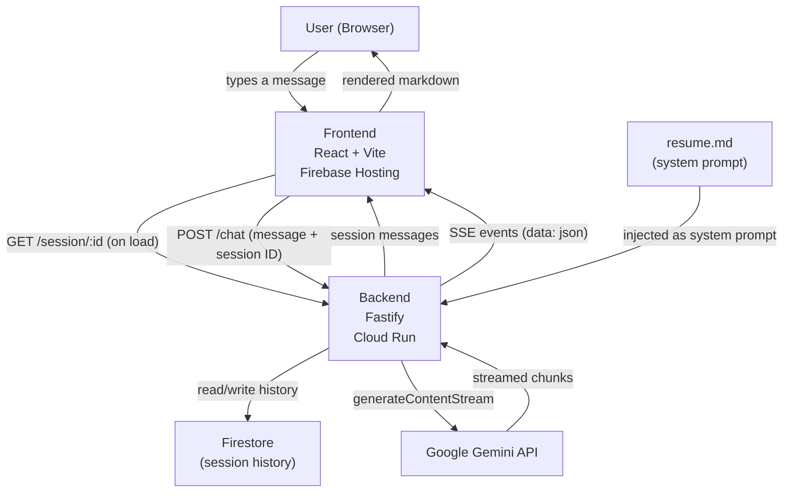

<p align="center">
  
</p>

<h1 align="center">ResumeBot</h1>

<p align="center">
  <a href="https://github.com/aaron-edwards/resume-bot"></a>
  &nbsp;
  <a href="https://www.linkedin.com/in/aaron-edwards-71520564/"></a>
</p>

<p align="center">An interactive resume chatbot — ask questions and get answers about my (Aaron Edwards') background, experience, and skills, powered by Google Gemini.</p>

## Overview

ResumeBot is a streaming chat interface primed with my resume. Recruiters and hiring managers can ask natural language questions and receive accurate, grounded answers in real time. The model is instructed to stay on-topic and admit when it doesn't know something.

## Architecture



**Request flow:**
1. On load, the frontend fetches existing session history from `GET /session/:id` (keyed by a UUID stored in `localStorage`)
2. User types a message and hits send — only the new message is sent to `POST /chat`
3. Backend loads the conversation history from Firestore and appends the new message
4. The resume is injected as a system prompt and the last 10 messages are sent to the Gemini streaming API
5. Each chunk is forwarded to the browser as an SSE event (`data: {"text":"..."}`)
6. Frontend appends each chunk to the assistant message in real time
7. On completion, the full updated conversation is saved back to Firestore
8. Stream ends with `data: [DONE]`

### Technologies

| Layer | Technology |
|---|---|
| Frontend | React 19, Vite, TypeScript, Tailwind CSS v4, Shadcn UI, TanStack Query |
| Backend | Fastify v5, Node.js, TypeScript |
| LLM | Google Gemini 2.5 Flash (via `@google/genai`) |
| Streaming | Server-Sent Events (SSE) |
| Persistence | Firestore (session history), `localStorage` (session ID) |
| Monorepo | Turborepo + pnpm workspaces |
| Linting | Biome |
| Testing | Vitest, @testing-library/react |
| Hosting | Firebase Hosting (frontend), GCP Cloud Run (backend) |

### Project structure

```
apps/
  web/        React frontend
  api/        Fastify backend
packages/
  types/              Shared TypeScript types (ChatMessage, ChatRequest)
  typescript-config/  Shared tsconfig
```

## Development

**Prerequisites:** Node.js 22+, pnpm

### Running locally

```sh
# Install dependencies
pnpm install

# Set the Gemini API key
echo "GEMINI_API_KEY=your_key_here" > apps/api/.env

# Start both frontend and backend
pnpm dev
```

- Frontend: http://localhost:5173
- Backend: http://localhost:3001

### Testing

```sh
pnpm test          # Run all tests once
pnpm test:watch    # Watch mode (run from apps/web or apps/api)
```

Tests are colocated with source files under `__tests__/` directories and cover:

- SSE parsing and streaming (`api.ts`)
- Chat state management, session loading, and error handling (`useChat`)
- UI components (`MessageBubble`, `Transcript`, `ChatInput`)
- API route validation, streaming, and session initialisation (`GET /session`, `POST /chat`)
- Gemini client role mapping and chunk filtering (`gemini.ts`)
- In-memory session store (`sessions/memory.ts`)

### Other commands

```sh
pnpm build        # Build all apps
pnpm lint         # Lint all apps
pnpm check-types  # Type-check all apps
```
